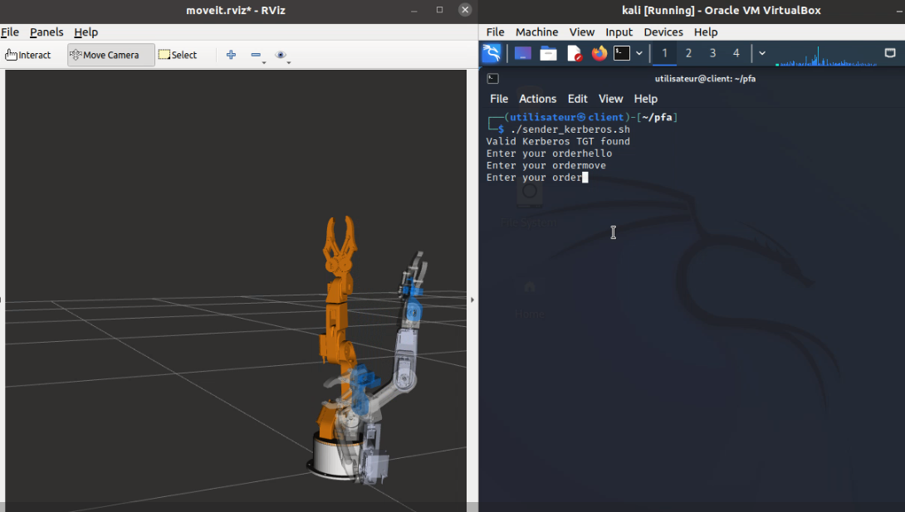

# Kerberos Authenticated Robotic Arm Control System
Description
This project provides a system for controlling a robotic arm using Kerberos authentication. The robotic arm is designed to be used in surgery in the future, and the system allows a doctor to connect as a client from a machine using Kerberos and control the arm deployed on a server machine.

The system consists of two main components:

A server program that controls the robotic arm and listens for incoming connections from clients.
A client program that allows a doctor to control the robotic arm.
The client program uses Kerberos authentication to securely connect to the server and control the arm. The arm is controlled with ROS, which provides a powerful platform for controlling robotic devices.

 

Note: This project is still in development and should not be used in a production environment.
